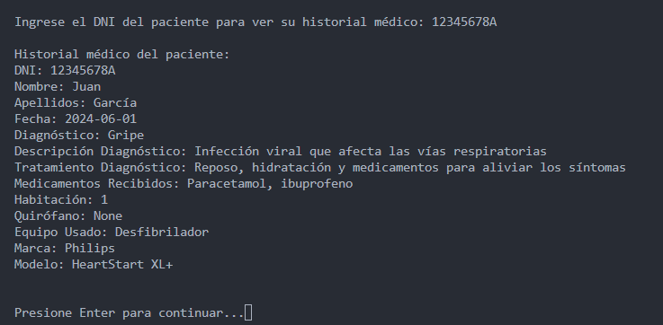
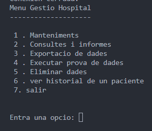

# AMPLIACIONES

## Ampliacion 1: Historial del paciente

Esta ampliacion tal y como su titulo lo dice es mostrar la informacion de paciente solicitado, para poder ver esa informacion el usuario tendra que escribir el DNI del paciente que desea ver

El usuario encontrara esta opcion en el apartado de conexion:

