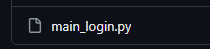
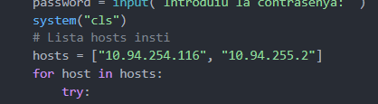
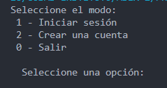
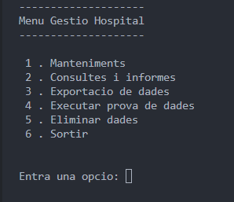
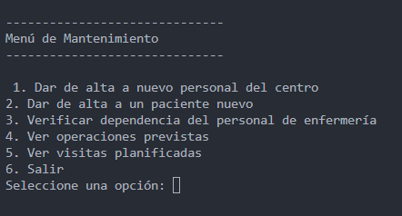
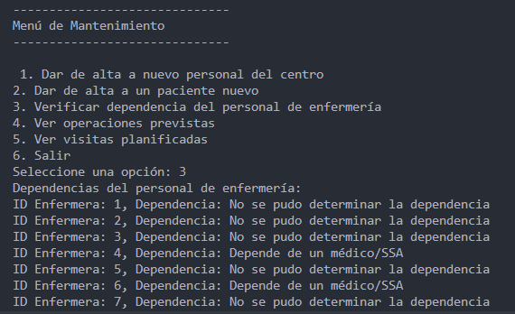
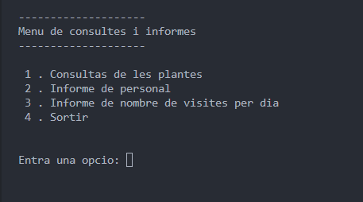
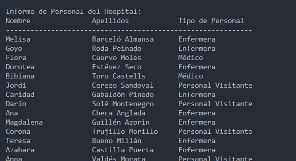

# USO DE EJECUCION SCRIPT

en caso de descargar los ficheros verificar que todos se encuentran en el misma carpeta tambien los usuarios tiene que verificar que el fichero "credenciales" tambien esta creada.

para ejecutar el script es importante ejecutar solo el script "main_login.py"

### importante!!!

en el script "conexion.py" debemos cambiar las ips que se conectan al servidor:

donde pone host cambiamos las ips por las ips de los servidores donde se encuentra alojado la base de datos, en este caso hay dos por que la primera ip es la del servidor principal (NODO 1) y la segunda seria el servidor secundario (NODO 2) diseñado para que en caso que una falle la otra siga ofreciendo conexion.

## LOGIN

Los usuario tendran 3 opciones iniciar sesion, registrarse en caso de no tener un usuario o salir del programa.

Una vez que el usuario inicie sesion accedera al apartado de conexion, donde el usuario podra acceder a las opciones que ven:

## Mantenimiento

el panel de mantenimiento en funcionamiento se ve asi:

En funcionamiento:

## PANEL DE CONSULTAS I INFORMES

en funcionamiento:

